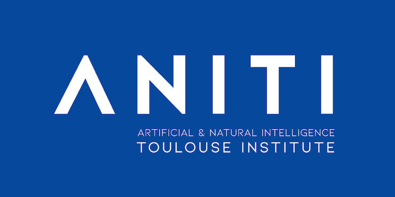



  
   

* Organized “Computational Probability and Monte Carlo Methods”, Talk by Distinguished
Prof.Karmeshu, Feb. 9, 2013.
* Organized “Signal Flow in Communication - Chalk and Talk by Prof.V Sinha”, Jan. 19, 2013.
* Organized “Artificial Intelligence and its Applications”, Nov. 3, 2012.
* Organized “National Level Technical Fest PLINTH”, Oct. 26-28, 2012.
* Organized “National Workshop on Computer Vision and Image Processing”, Sept. 8-9, 2012.
* Organized Workshop on “Antennas and RF Systems ” sponsored by Agilent Technologies, March
24-25, 2012.
* Organized Workshop on “Next Generation W3C web technologies”, February 12, 2012.
* Teaching Assistant for the students in electronics course lab at LNMIIT.
* Teacher at Mess Workers Education Program at LNMIIT
* Organized Abhkriti and Paper presentation at LNMIIT during National level festival _VIVACITY 2011_ [link](http://vivacity.lnmiit.ac.in/)
